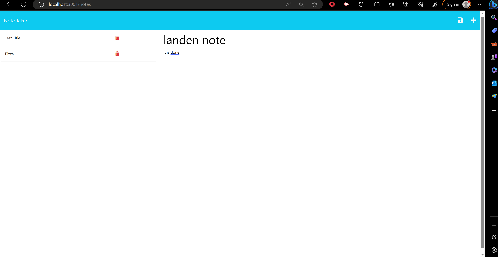

# Landen Note Taker App

## Title

Landen Note Taker App

# Table of Contents

- [GitHub](#github)
- [Description](#description)
- [Installation](#installation)
- [Usage](#usage)
- [License](#license)
- [How To Contribute](#howtocontribute)
- [Tests](#tests)
- [Screenshot](#screenshot)
- [Link](#link)

## GitHub

[Link](https://www.github.com/lwalker107)

## Email

landenwalker880@gmail.com

## Description

Note Taker app that lets the user create and save notes that persist even when you leave the application and you can go back and delete the note whenever you want.

## Installlation 

npm i

## Usage

It is easy to push changes as long as you are working on your own separate branch and I approve of the changes.

## License

MIT

## How to Contribute

My GitHub name and/or my email address.

## Tests

npm run tests

## Screenshot

## Link 

https://lwalker107.github.io/Note-Taker-landen/